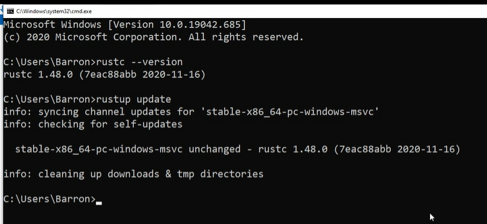
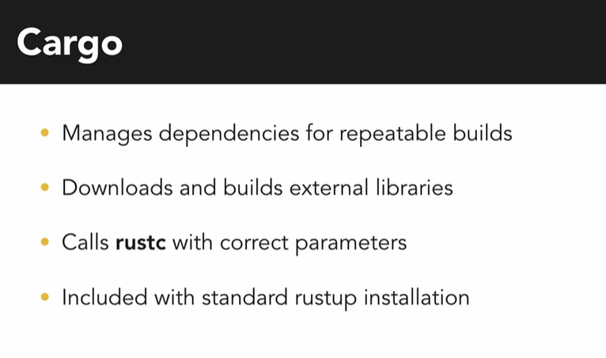
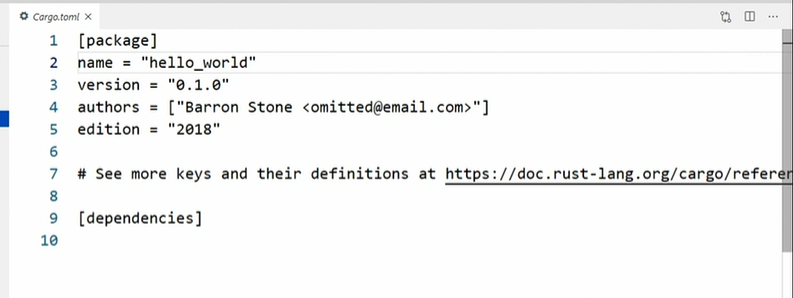
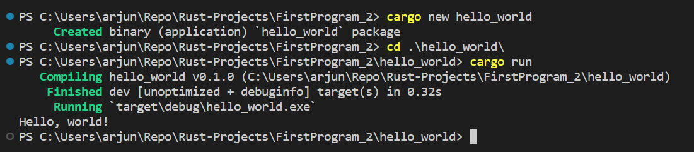
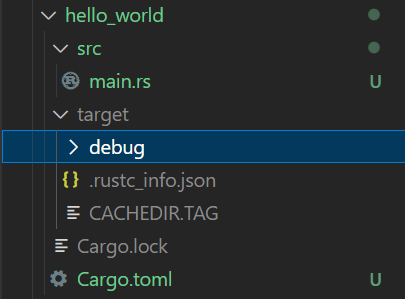

1. Download and run rust-init.exe

# cargo - package manager of rust

# cargo.toml file

    * TOML - Tom's Obvious Minimal Language
  * 
    Example:

    

# Creating new project using cargo

# Project folder structure

# Debug vs release build cmds

    * cargo run
    * cargo build --release