# Declaring variables

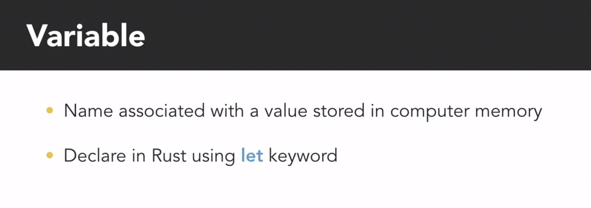

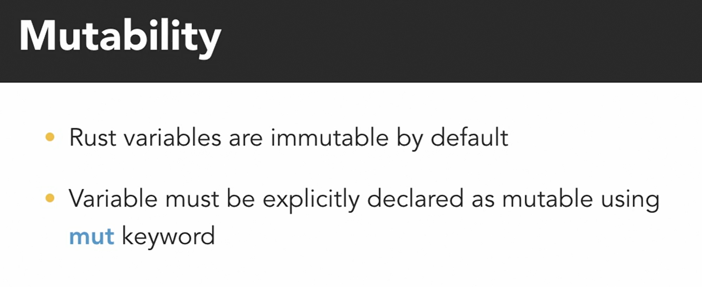

# Naming guidelines

[GUIDELINES](https://rust-lang.github.io/api-guidelines/about.html)

# Integer Data

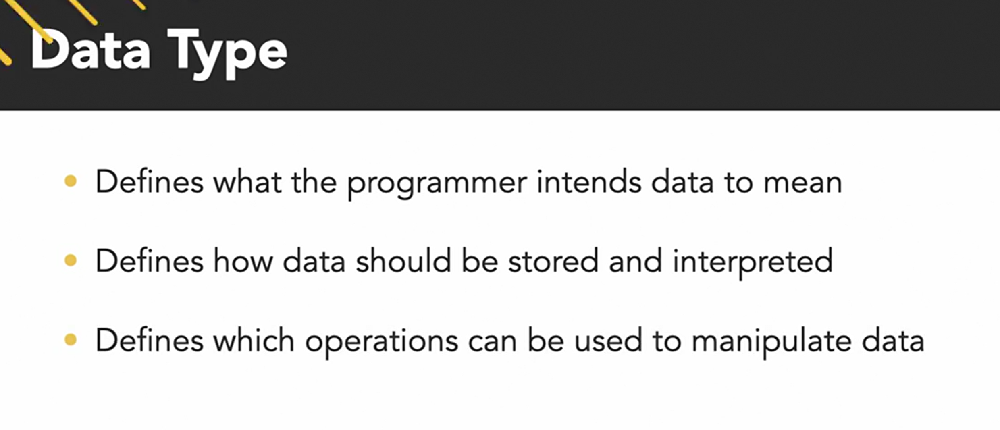

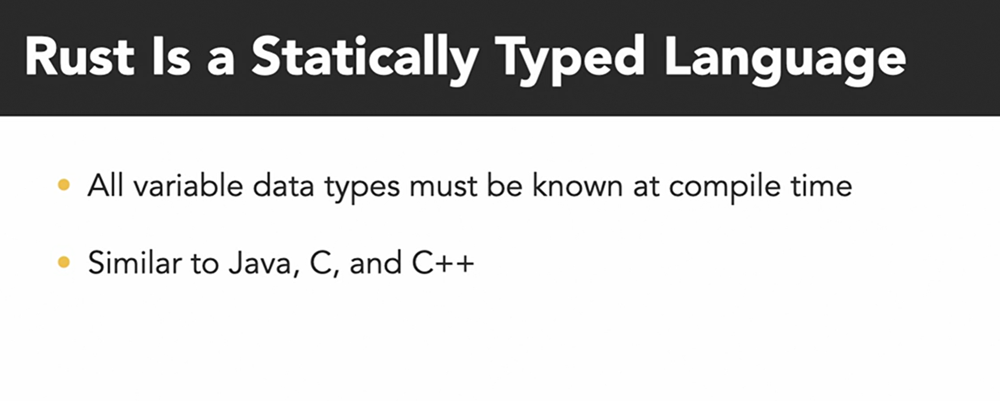

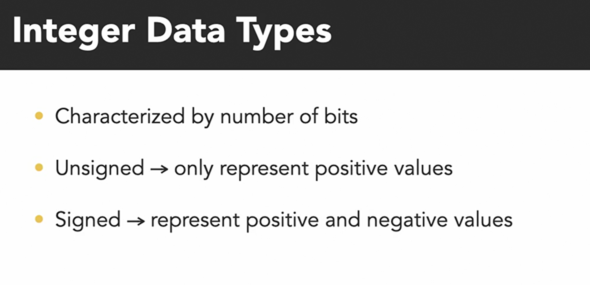

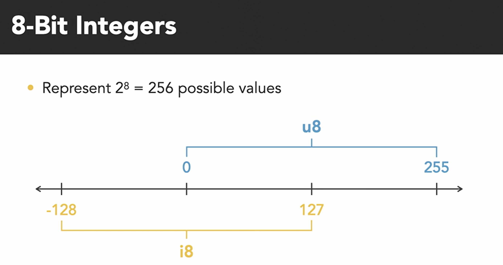

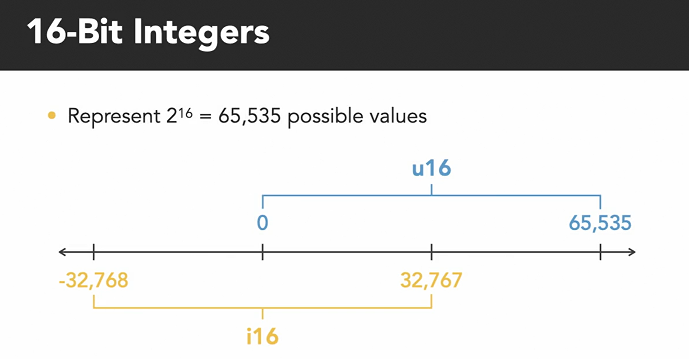

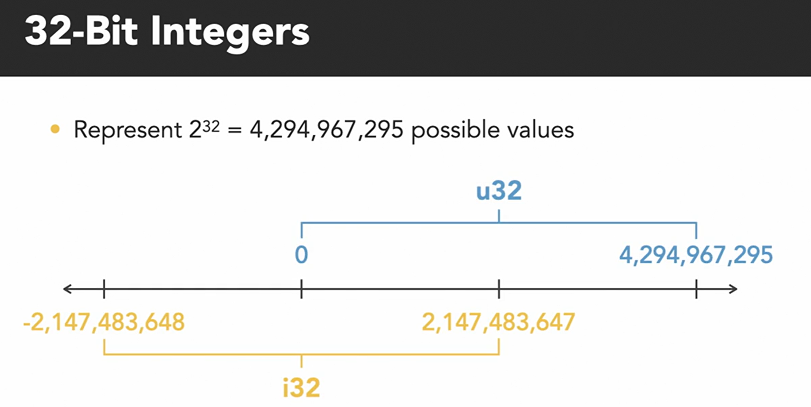

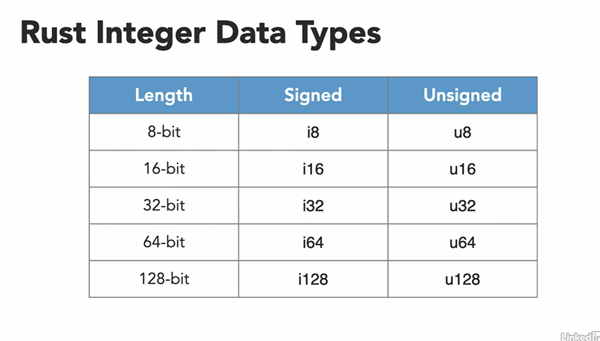

# Float datatypes

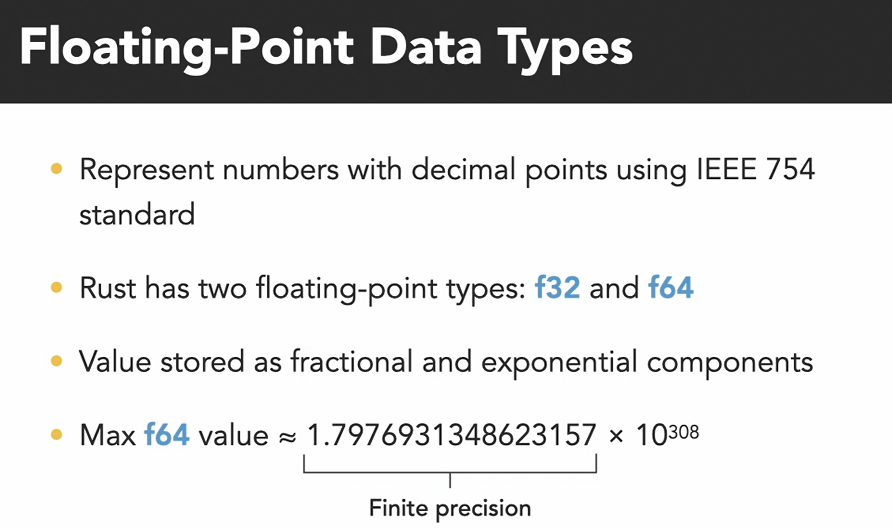

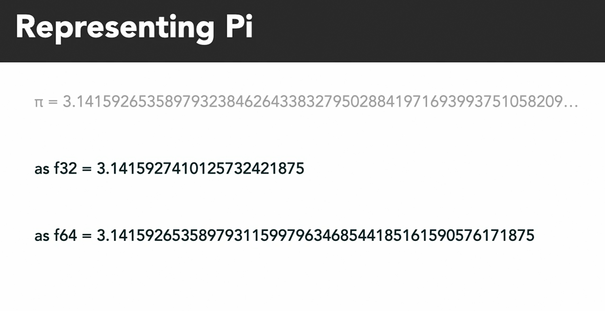

# Arithmatic operations

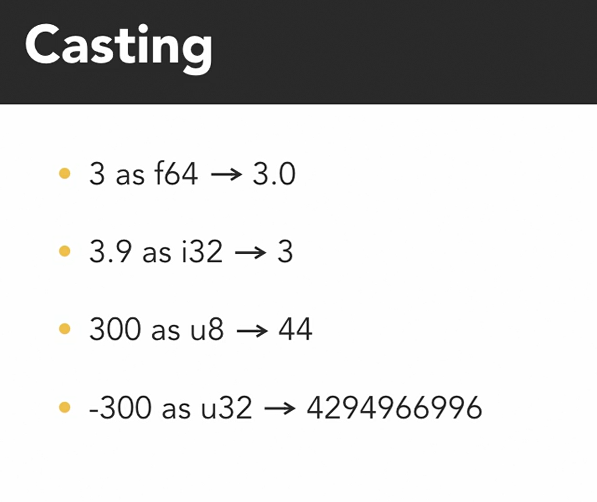

# Bit-wise Operations

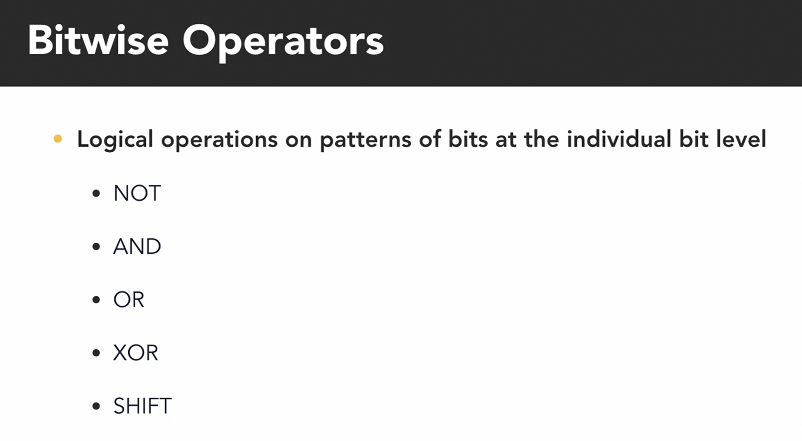

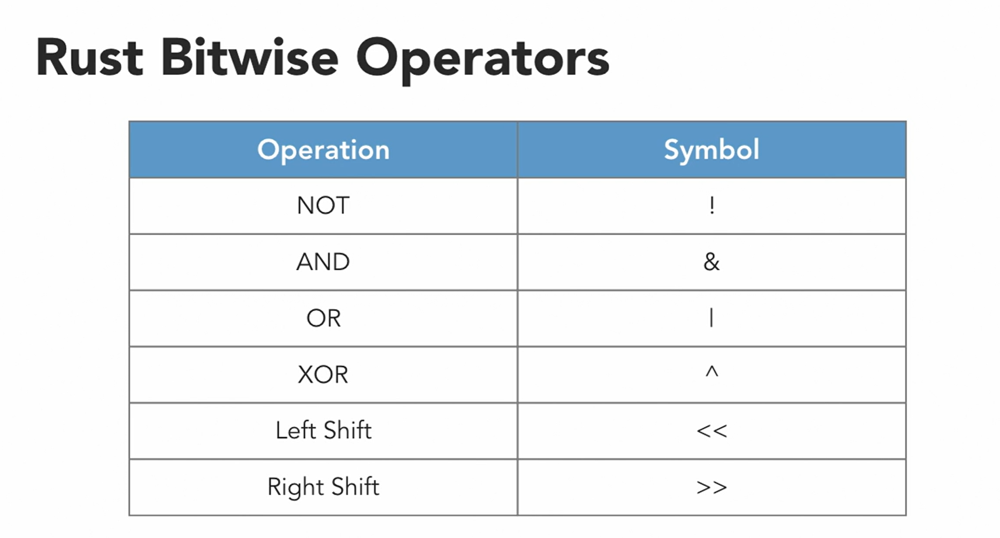

# Boolean 

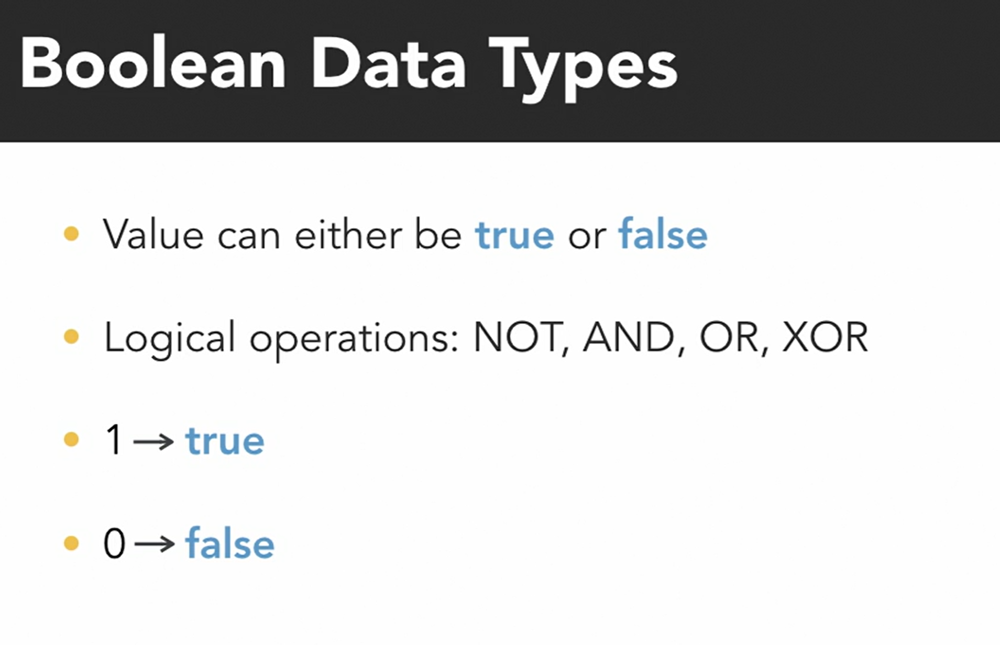