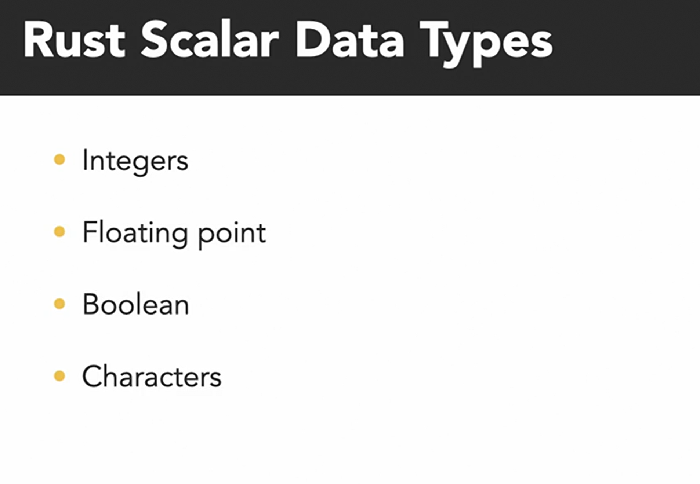

# Declaring variables

# Naming guidelines

[GUIDELINES](https://rust-lang.github.io/api-guidelines/about.html)

# Integer Data

# Float datatypes

# Arithmatic operations

# Bit-wise Operations

# Boolean 

